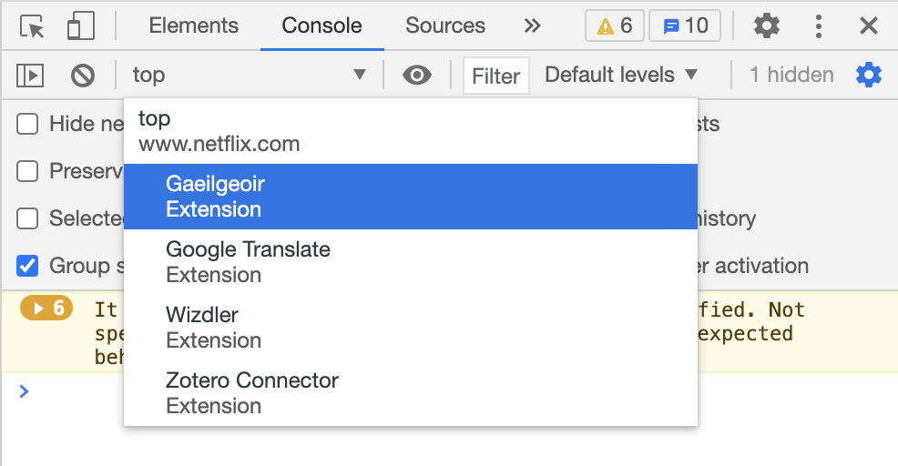

# aeilgeoir 

A Google Chrome extension that transforms a curated list of websites into Irish.

## Adding Translations

Support for new websites (e.g. `website.com`) can be added directly as a JSON file under `translations/website.com.json`.

Updates to the universal rules (which are applied to every website) can be made to `chrome/universal_translations.js`

CSV files with a list of currently missing translations can be generated for a website by following these steps:

1. Open the web page in a Chrome browser where the extension is active
1. Right click anywhere on the page and choose 'Inspect'
1. In the 'Developer Console' that opens, choose 'Console'.
1. Choose the 'Gaeilgeoir' context instead of 'top': 
1. Type `exportTranslations()` into the console and hit enter. This will trigger a CSV file download that can then be edited in e.g. Excel.

The edited CSV file can then be used to update the files in `translations/` by running `scripts/jsonify.py {PATH_TO_CSV_FILE}`

## Testing Your Changes

To test local changes to the extension, go to `chrome://extensions/` in your browser.

Click 'Load Unpacked', navigate to the `Gaeilgeoir/chrome` directory and hit 'Select' (Developer Mode most be enabled in the top right of the screen).

To pick up changes you've made locally you must hit the refresh/reload button on the extension card in `chrome://extensions/`.

To test changes to translation files, you need to push your changes to a fork / branch and update the URL used in `chrome/gaeilgeoir.js` (in the ` xhttp.open(...)` method).
